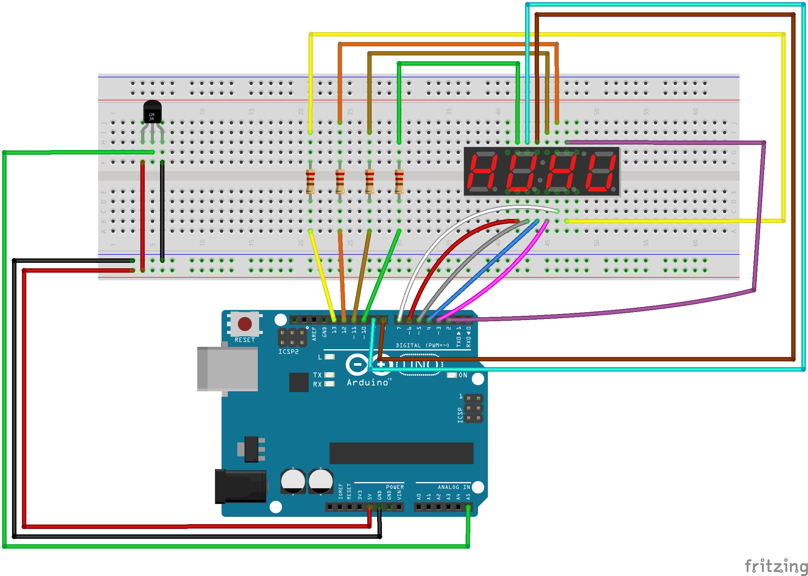

# Simple thermometer with arduino

This sketch simulates a thermometer using a Temperature sensor and a 4 digit seven segment display.

The **libraries** used are:
* [SevSeg](https://github.com/DeanIsMe/SevSeg)
* [DHT-sensor-library](https://github.com/adafruit/DHT-sensor-library)

## Circuit

## Imprtant notes

If you change the pin connection remember to change them in the sketch too!
